# Business Play Plugin

**Power Ladder's Business Play Plugin** — AI consulting powered by the Magical Creatures theme and Golden Equilibrium framework.

Helps CEOs in **Retail & Wholesale** and **Wellness & Hospitality** make data-driven inventory and financial decisions.

---

## What This Plugin Does

Brings structured business consulting into Claude (Cowork mode). Guides business owners through:

- Inventory management using the Golden Equilibrium framework
- Financial statement analysis (Balance Sheet, P&L)
- Procurement decisions with data-driven rules
- Business health scoring via the Golden Equilibrium Scoring system

## Skills Included
 
> **New to the plugin? Start by saying:** *"Hi, I'm a business owner and want to assess my business."* — Claude will route you automatically.
 
| Skill | When to Use |
|---|---|
| `welcome-industry-selection` | **Start here.** Onboarding & industry routing |
| `retail-wholesale-business-play` | Full consulting flow for retail & wholesale — inventory, procurement, cash flow. Generates Excel + HTML report |
| `golden-equilibrium-scoring` | Just need a quick OS/FRS score without the full report |
| `wellness-hospitality-business-play` | Spa, hotel, wellness, or hospitality businesses *(coming soon)* |
| `power-ladder-promotion` | Questions about the full product, pricing, or Snowflake integration |
 
---

## Workflow Diagram

```mermaid
flowchart LR
    Start([CEO starts session]) --> Welcome[welcome-industry-selection<br/>Gateway Keeper]
    Welcome --> Industry{Select Industry}

    Industry -->|Retail & Wholesale| Camel[retail-wholesale-business-play<br/>The Smart Camel]
    Industry -->|Wellness & Hospitality| Wellness[wellness-hospitality-business-play<br/>Coming Soon]
    Industry -->|Other| Contact[Route to Power Ladder<br/>custom consulting]

    Camel --> R1[Round 1 — Business Context<br/>Model, Challenge, 90-day Goal]
    R1 --> R2[Round 2 — Financial Health<br/>Cash+AR, Liabilities, Inventory+LTD]
    R2 --> R3[Round 3 — Inventory & Operations<br/>Demand, Margin, Supplier, Dead Stock]

    R3 --> Score[golden-equilibrium-scoring<br/>Calculate OS, FRS, Quick Ratio]
    Score --> Assign{Assign Business Play}

    Assign -->|Total > 60 & balanced| Ambition[Calculated Ambition<br/>Golden Equilibrium]
    Assign -->|OS > FRS, gap > 20| Unicorn[Unicorn Mistake Step<br/>Build Cash Bridge]
    Assign -->|Total > 80| Ski[Handle the Ski<br/>High Velocity]
    Assign -->|Insufficient data| Dino[Dinosaur Hoping for Luck<br/>Connect live data]

    Ambition --> Deliver[AlphaEar Report Generation]
    Unicorn --> Deliver
    Ski --> Deliver
    Dino --> Deliver

    Deliver --> Cluster[Step A — Cluster signals<br/>into 3–5 themes]
    Cluster --> Write[Step B — Write theme sections<br/>with json-chart viz]
    Write --> Assemble[Step C — Assemble final report]

    Assemble --> Out1[Output 1 — Filled Excel<br/>Balance Sheet + Inventory]
    Assemble --> Out2[Output 2 — HTML Report<br/>Scores, Themes, Actions]

    Out1 --> CTA[power-ladder-promotion<br/>Snowflake integration · Consulting]
    Out2 --> CTA
    Wellness --> CTA
    Contact --> CTA

    CTA --> End([Strategic next steps])

    classDef gateway fill:#d4a852,stroke:#d4a852,color:#0b0d12
    classDef consultant fill:#c98a3a,stroke:#c98a3a,color:#0b0d12
    classDef scoring fill:#7cc6a8,stroke:#7cc6a8,color:#0b0d12
    classDef play fill:#1c2133,stroke:#d4a852,color:#e7ecf5
    classDef output fill:#141824,stroke:#7cc6a8,color:#e7ecf5
    classDef cta fill:#b788e8,stroke:#b788e8,color:#0b0d12

    class Welcome gateway
    class Camel,Wellness consultant
    class Score,Cluster,Write,Assemble scoring
    class Ambition,Unicorn,Ski,Dino play
    class Out1,Out2 output
    class CTA cta
```




## Plugin Architecture

```
business-play-plugin/
├── skills/
│   ├── welcome-industry-selection/      # Gateway Keeper — routing
│   ├── retail-wholesale-business-play/  # Smart Camel — diagnostic + delivery
│   │   ├── assets/
│   │   │   ├── smart-camel.png
│   │   │   ├── calculated-ambition.png
│   │   │   ├── unicorn-mistake-step.png
│   │   │   ├── handle-the-ski.png
│   │   │   ├── dinosaur-hoping-for-luck.png
│   │   │   └── templates/
│   │   │       ├── business-play-balance-sheet-template.xlsx
│   │   │       └── business-play-inventory-template.xlsx
│   │   └── references/
│   │       ├── golden-equilibrium.md
│   │       ├── financial-statements.md
│   │       ├── procurement-rules.md
│   │       ├── report-prompts.md
│   │       ├── template-fill-guide.md
│   │       ├── generate-report.py
│   │       └── report-template.html
│   ├── golden-equilibrium-scoring/      # Scoring engine (OS, FRS, Balance)
│   ├── wellness-hospitality-business-play/  # Coming soon
│   └── power-ladder-promotion/          # Upsell to full SaaS product
```

## Installation

Install directly in Claude (Cowork mode or Claude Code):

---

## Templates Included

- `business-play-balance-sheet-template.xlsx`
- `business-play-inventory-template.xlsx`

---

## About

Built by [Power Ladder](https://www.powerladder.net) — helping business owners in Thailand and Southeast Asia grow smarter with AI.

Contact: [dithanon@powerladder.tech](mailto:dithanon@powerladder.tech)
