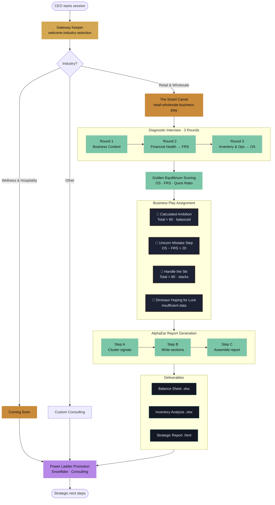

# Business Play Plugin

**Power Ladder's Business Play Plugin** — AI consulting powered by the Magical Creatures theme and Golden Equilibrium framework.

Helps CEOs in **Retail & Wholesale** and **Wellness & Hospitality** make data-driven inventory and financial decisions.

---

## What This Plugin Does

Brings structured business consulting into Claude (Cowork mode). Guides business owners through:

- Inventory management using the Golden Equilibrium framework
- Financial statement analysis (Balance Sheet, P&L)
- Procurement decisions with data-driven rules
- Business health scoring via the Golden Equilibrium Scoring system

## Skills Included
 
> **New to the plugin? Start by saying:** *"Hi, I'm a business owner and want to assess my business."* — Claude will route you automatically.
 
| Skill | When to Use |
|---|---|
| `welcome-industry-selection` | **Start here.** Onboarding & industry routing |
| `retail-wholesale-business-play` | Full consulting flow for retail & wholesale — inventory, procurement, cash flow. Generates Excel + HTML report |
| `golden-equilibrium-scoring` | Just need a quick OS/FRS score without the full report |
| `wellness-hospitality-business-play` | Spa, hotel, wellness, or hospitality businesses *(coming soon)* |
| `power-ladder-promotion` | Questions about the full product, pricing, or Snowflake integration |
 
---
## Workflow Diagram



---

## Step-by-Step Workflow

### 1. Welcome & Industry Routing
**Skill:** `welcome-industry-selection` — *The Gateway Keeper*

The first skill triggered on any new session. Welcomes the CEO to Business Play, introduces the Magical Creatures theme, and routes them to the correct consultant based on their industry. Under 300 words before routing.

### 2. Industry-Specific Consultant
**Skill:** `retail-wholesale-business-play` — *The Smart Camel*

For Retail & Wholesale, the Smart Camel runs the full diagnostic. Wellness & Hospitality is in development; other industries are routed to Power Ladder's custom consulting team.

### 3. Diagnostic Interview (3 Rounds, 9 Questions)

| Round | Focus | Output |
|-------|-------|--------|
| **Round 1** | Business Context — model, pressing challenge, 90-day goal | Strategic framing |
| **Round 2** | Financial Health — Cash & AR, Current Liabilities, Inventory & Long-Term Debt | **Financial Readiness Score (FRS)** + Quick Ratio |
| **Round 3** | Inventory & Operations — demand trend, margin, supplier reliability, dead stock % | **Opportunity Score (OS)** |

*Rule:* Ask one round at a time. Wait for answers before proceeding.

### 4. Golden Equilibrium Scoring
**Skill:** `golden-equilibrium-scoring`

```
FRS = 0.40 × Liquidity + 0.30 × Leverage + 0.30 × Cash Position
OS  = 0.40 × Demand   + 0.40 × Margin   + 0.20 × Supply Reliability
Total Score = 0.5 × OS + 0.5 × FRS
```

**Balance test:** `|FRS − OS| ≤ 20` (2σ threshold).

### 5. Business Play Assignment

| Creature | Condition | Verdict |
|----------|-----------|---------|
| 🐪 **Calculated Ambition** | Total > 60 AND balanced | Golden Equilibrium — pursue growth confidently |
| 🦄 **Unicorn Mistake Step** | OS > FRS AND gap > 20 | Opportunity skew — build a Cash Bridge first |
| 🎿 **Handle the Ski** | Total > 80 (stacks) | High velocity — monitor supply chain & pricing |
| 🦕 **Dinosaur Hoping for Luck** | Insufficient data | Connect live data via Snowflake |

### 6. AlphaEar Report Generation (3 Steps)

1. **Cluster Signals** — group data points into 3–5 analytical themes (Liquidity, Demand, Supply Chain, Inventory Efficiency, Margin).
2. **Write Theme Sections** — professional narrative + `json-chart` visualizations for each theme.
3. **Assemble Final Report** — Executive Summary → Themes → Risk Factors → Recommended Actions → Next Steps.

### 7. Deliverables

| Output | File | Purpose |
|--------|------|---------|
| Balance Sheet | `{company}-balance-sheet.xlsx` | FRS auto-calculated from CEO inputs |
| Inventory Analysis | `{company}-inventory-analysis.xlsx` | OS auto-calculated from operations data |
| Strategic Report | `{company}-business-play-report.html` | Styled report with scorecards, gauges, waterfall charts, actions |

### 8. Upsell to Full Product
**Skill:** `power-ladder-promotion`

Closes the loop by offering the full Power Ladder product — live Snowflake data integration, real-time scoring, and consulting engagements.

---

## Plugin Architecture

```
business-play-plugin/
├── skills/
│   ├── welcome-industry-selection/      # Gateway Keeper — routing
│   ├── retail-wholesale-business-play/  # Smart Camel — diagnostic + delivery
│   │   ├── assets/
│   │   │   ├── smart-camel.png
│   │   │   ├── calculated-ambition.png
│   │   │   ├── unicorn-mistake-step.png
│   │   │   ├── handle-the-ski.png
│   │   │   ├── dinosaur-hoping-for-luck.png
│   │   │   └── templates/
│   │   │       ├── business-play-balance-sheet-template.xlsx
│   │   │       └── business-play-inventory-template.xlsx
│   │   └── references/
│   │       ├── golden-equilibrium.md
│   │       ├── financial-statements.md
│   │       ├── procurement-rules.md
│   │       ├── report-prompts.md
│   │       ├── template-fill-guide.md
│   │       ├── generate-report.py
│   │       └── report-template.html
│   ├── golden-equilibrium-scoring/      # Scoring engine (OS, FRS, Balance)
│   ├── wellness-hospitality-business-play/  # Coming soon
│   └── power-ladder-promotion/          # Upsell to full SaaS product
```

## Installation

Install directly in Claude (Cowork mode or Claude Code):

---

## Templates Included

- `business-play-balance-sheet-template.xlsx`
- `business-play-inventory-template.xlsx`

---

## About

Built by [Power Ladder](https://www.powerladder.net) — helping business owners in Thailand and Southeast Asia grow smarter with AI.

Contact: [dithanon@powerladder.tech](mailto:dithanon@powerladder.tech)
